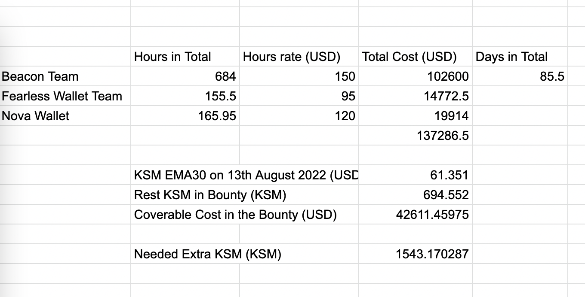

# Review on Bounty3 Submission on June 2022

[Bounty #3](https://kusama.polkassembly.io/bounty/3) aims to provide a signing solution to bridge the dApps and mobile wallets, which using Beacon Network as a decentralized peer to peer network of nodes based on the matrix protocol, with trustless and encrypted message relaying.

The bounty includes the integration with Beacon SDK with Substrate-based Network, and the integration with Wallet in both iOS and Android. Overall the bounty is completed by Beacon team, Fearless Wallet team and Nova Wallet by June 2022 as the deliverables are listed below.

# Checklist

## Beacon Team

[Detail Report](./202206Beacon_Submission.pdf)

- [x] Beacon Substrate messages
PermissionRequest is not include in the MessageType
https://github.com/airgap-it/beacon-sdk/blob/v3.0.0/packages/beacon-blockchain-substrate/src/types/message-type.ts

- [x] Development Beacon Example dApp
https://andreasgassmann.github.io/apps/#/explorer

- [x] Beacon Typescript SDK
     - Beacon SDK: https://github.com/airgap-it/beacon-sdk
 
- [x] Beacon Swift and Kotlin SDK
    - Kotlin Sdk: https://github.com/airgap-it/beacon-android-sdk
    - Swift SDK: https://github.com/airgap-it/beacon-ios-sdk
    
- [x] Beacon Node infrastructure setup
   - beacon-test-node-1.crystal.papers.tech 
   - beacon-test-node-2.crystal.papers.tech
     
- [x] Beacon SDKs developer documentation
  
Improvement need to be done:
1. PermissionRequest is not include in the MessageType
https://github.com/airgap-it/beacon-sdk/blob/v3.0.0/packages/beacon-blockchain-substrate/src/types/message-type.ts
2. Current Beacon has two nodes infrastructure set up, need a document to guide user/projects on how to set up a replica relay node.
3. In the Beacon SDK's documentation, especially 
   - in the getting start part, there is no Substrate-related information, as you described before "document to make the developer onboarding process as smooth as possible", this part should be somehow added here.
   - in the first dApp part there is no Substrate is mentioned. Regarding the documentation, I suggest add the app side sample code in the https://github.com/AndreasGassmann/apps/blob/master/packages/react-api/src/Api.tsx and wallet side sample code with Nova or Fearless Wallet.
 

## Nova Wallet Team (iOS)
[Recorded Video](../res/Nova_Beacon_DApp_demo.mp4)

NOTICE: The feature is not release in production version of Nova wallet yet, as there is no usable application, which might create confusion for the current users.
After either the integration of Beacon with Polkadot.js extension or any application in production use Beacon SDK, the feature will come into alive. 

Related code: https://github.com/nova-wallet/nova-ios-app/tree/beacon/novawallet/Modules/Experimental/Signers/SignerConnect

## Fearless Wallet Team (Android)
[Workable APK with Demo app](../res/FW%20Becon%20PoC%20debug%20build.apk)

NOTICE: The feature is not release in production version of Fearless wallet yet, as there is no usable application, which might create confusion for the current users.
After either the integration of Beacon with Polkadot.js extension or any application in production use Beacon SDK, the feature will come into alive.

Related Code: https://github.com/soramitsu/fearless-Android/tree/featue/beacon_2.0/feature-wallet-impl/src/main/java/jp/co/soramitsu/feature_wallet_impl/domain/beacon

## Bounty Distribution Recap

The reward of the bounty is paid in two parts due to the size of the work is too big. 

The first part is summarized in: https://github.com/hanwencheng/Substrate-Mobile-Injector/tree/main/Submission and is distributed by the multi-sig account FC4tZgWUDpg1AK5uoY7Z9bTaUanemyipoG7Tk8W9YXpxvZ6 with 394.328 KSM, the rest KSM reserved for part2 is 694.552 KSM.

The multi-sig wallet is currently handled by 4 accounts for transparency, two from me, one from Pascal of Beacon team, one from Anton of Fearless/Nova team.

## Cost Calculation

KSM price based on [last 30 days average](https://docs.google.com/spreadsheets/d/15-nY95I_AeoIWr-BMk2j3CqM9ELkg3YU5EKjMz87bZ4/edit#gid=0).

## Refill KSM 

Due to the volatility of KSM(The KSM price is 368 USD when we distribute the first part of the bounty, now is 55.392 USD), we need to add more KSM into the bounty in order to cover the cost of the second part of the bounty.

According to the calculation, we still need 1783.9 KSM.

## Future Plan

Currently the adoption of Beacon Protocol in Polkadot Ecosystem is strongly depend on the decision that if dApps want to integrate Beacon SDK. We find a better way to gain the adoption is to integrate the Beacon SDK in Polkadot.js extension as almost every dApp has support Polkadot.js/extension to connect the wallet. It is also beneficial for dApps because they do not need to extra effort to integrate with Beacon.

So there is some extra work to do on Polkadot.js/extension, the plan is detailed in the Github issue [here](https://github.com/polkadot-js/extension/issues/989)

Beacon team will work closely with Polkadot.js/extension team to make this happen, and apply for a new bounty when it is necessary.
