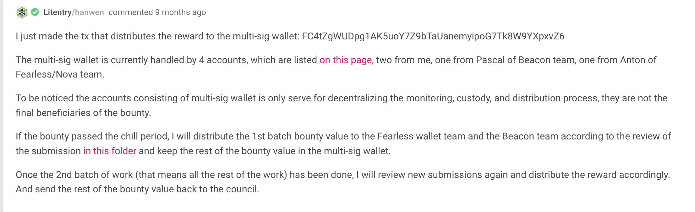

# Bounty #3 Top-up Request

## Overview

[Bounty #3](https://kusama.polkassembly.io/bounty/3) aims to provide a signing solution to bridge the dApps and mobile wallets, which using Beacon Network as a decentralized peer to peer network of nodes based on the matrix protocol, with trustless and encrypted message relaying.

The bounty includes the integration with Beacon SDK with Substrate-based Network, and the integration with Wallet in both iOS and Android. Overall the bounty is completed by Beacon team, Fearless Wallet team and Nova Wallet by June 2022.

The bounty include relatively more work which could be split into different stages. In order to cover the financial risk for development team, we decide to split the distribution of the bounty into 2 parts. The first part is distributed(on [Subscan](https://kusama.subscan.io/account/FC4tZgWUDpg1AK5uoY7Z9bTaUanemyipoG7Tk8W9YXpxvZ6)) in November 2021 and rest of KSM is hold in a multi-sig wallet on KSM: FC4tZgWUDpg1AK5uoY7Z9bTaUanemyipoG7Tk8W9YXpxvZ6. In June 2022, the rest part of the bounty is completed, but the remaining KSM in the bounty can't cover the cost because KSM price drops in 2022.

As the curator of the bounty, hereby I kindly ask the council to approve the request to top up 1543.17 KSM into the bounty according to the calculation.  

## Reviews

For the detail of the review of bounty 3 please refer to: 
* [Review of Part 1 on 2021 October - Beacon](./202110Beacon_Review.md)
* [Review of Part 1 on 2021 October - Fearless Wallet](./202110Fearless_Submission_Review.md)
* [Review of Part 2 on 2022 June](./202206Review.md)

## Bounty Distribution Recap

The reward of the bounty is paid in two parts due to the size of the work is big which may introduce financial risk to the teams if we only distribute the reward by the completion of the bounty. 

The first part is summarized in: https://github.com/hanwencheng/Substrate-Mobile-Injector/tree/main/Submission and is distributed by the multi-sig account FC4tZgWUDpg1AK5uoY7Z9bTaUanemyipoG7Tk8W9YXpxvZ6 with 394.328 KSM, the rest KSM reserved for part2 is 694.552 KSM. 

The discussion is followed on [Polkassembly](https://kusama.polkassembly.io/bounty/3#75f2df36-575c-4a1e-973d-426fc01542b1)

The multi-sig wallet is currently handled by 4 accounts for transparency, two from me, one from Pascal of Beacon team, one from Anton of Fearless/Nova team.

To be noticed here. Anton was a team member of Fearless Wallet team and during the development he switched his role to only present Nova team due to the reconstructing of the companies. Anton's role in the multi-sig is not changed as he consistently worked for the bounty and provided useful insights for both teams. This is under the agreement of both Nova team and Fearless Wallet team, and does not introduce any conflict into the reward distribution.

## Refill KSM 

Due to the volatility of KSM(The KSM price is 368 USD when we distribute the first part of the bounty, now is 61.351 USD), we need to add more KSM into the bounty in order to cover the cost of the second part of the bounty.

According to the calculation, we still need 1543.17 KSM.

### Future Plan

Currently, the adoption of Beacon Protocol in Polkadot Ecosystem is strongly depend on the decision that if dApps want to integrate Beacon SDK. We find a better way to gain the adoption is to integrate the Beacon SDK in Polkadot.js extension as almost every dApp has support Polkadot.js/extension to connect the wallet. It is also beneficial for dApps because they do not need to extra effort to integrate with Beacon.

So there is some extra work to do on Polkadot.js/extension, the plan is detailed in the Github issue [here](https://github.com/polkadot-js/extension/issues/989)

Beacon team will work closely with Polkadot.js/extension team to make this happen, and apply for a new bounty when it is necessary.

### Contact Information
* Curator: Hanwen Cheng hanwen@litentry.com
* Beacon Network: Pascal p.brun@papers.ch
* Nova Wallet: anton@novawallet.io
* Fearless Wallet: petrov@soramitsu.co.jp
